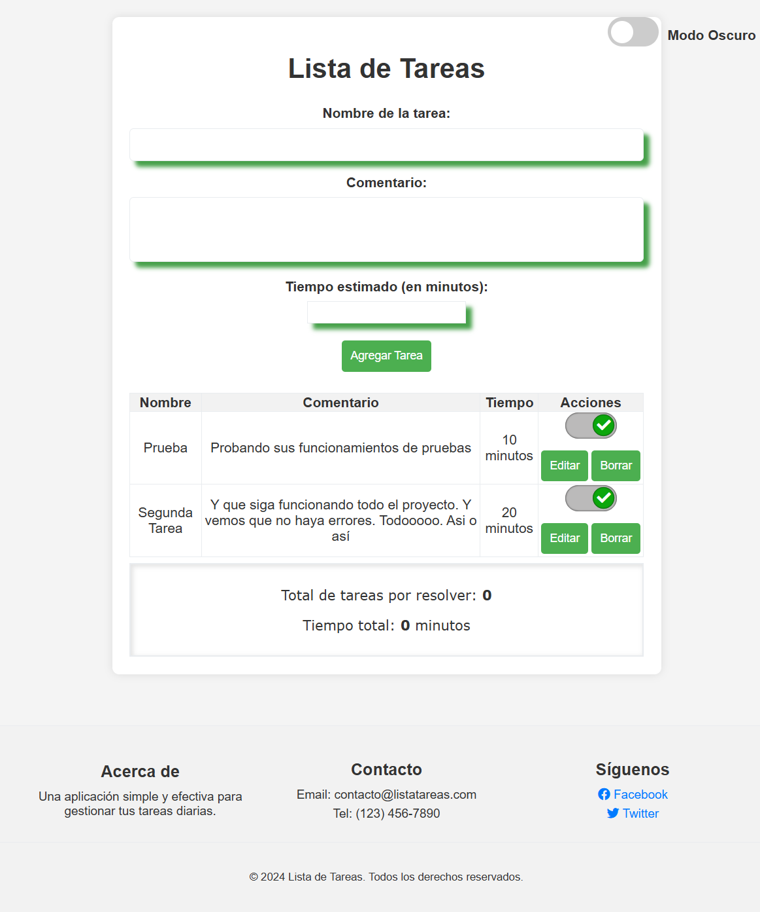
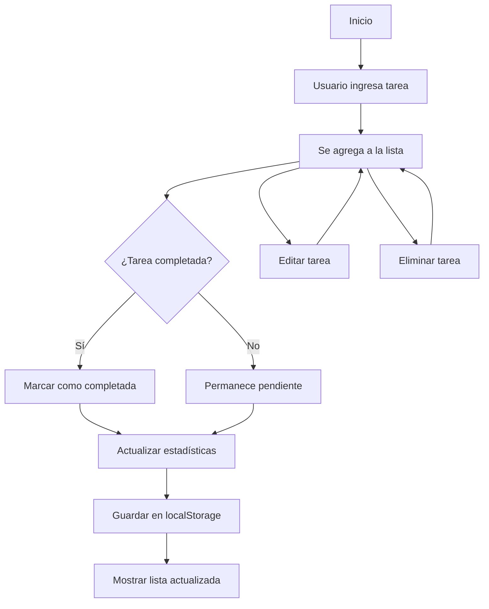

# Lista de Tareas

## 👨‍💻 Autor

**Cristian R. Sanchez**  
*Desarrollador Web Full Stack*

📍 **Ubicación:** Buenos Aires, Argentina   
📧 **Email:** cris1411@gmail.com   
🔗 **LinkedIn:** [Cristian R. Sanchez](https://www.linkedin.com/in/cristian-roberto-sanchez-canesin-044283b7/)  
🐙 **GitHub:** [Cris1411](https://github.com/Cris1411)  
🌐 **Portfolio:** [mi Portfolio](https://cristian-mi-portfolio.netlify.app/)  

---

## 📅 Información del Proyecto

- **Fecha de Creación:** Noviembre 2024
- **Última Actualización:** Diciembre 2024
- **Versión:** 1.0.0
- **Estado:** ✅ Completado

---

## Vista Previa

A continuación se muestra una captura de pantalla de la aplicación en funcionamiento:



---

## Diagrama del Flujo de la Aplicación



---

## Descripción
Esta es una aplicación web de lista de tareas que permite a los usuarios crear, gestionar y organizar sus tareas diarias. La aplicación incluye características como marcado de tareas completadas, eliminación de tareas y una interfaz de usuario intuitiva.

## Características Principales
- Creación de nuevas tareas
- Marcado de tareas como completadas
- Eliminación de tareas
- Interfaz de usuario moderna y responsiva
- Animaciones suaves en las interacciones
- Persistencia de datos en el almacenamiento local

## Tecnologías Utilizadas
- HTML5
- CSS3
- JavaScript
- Font Awesome (para iconos)
- LocalStorage (para persistencia de datos)

## Estructura del Proyecto
```
ListaTareas/
├── index.html          # Archivo principal HTML
├── styles/
│   ├── styles.css      # Estilos principales
│   ├── checkbox.css    # Estilos para el checkbox personalizado
│   ├── dark-mode.css   # Estilos para el modo oscuro
│   ├── dark-mode-button.css # Estilos para el botón de modo oscuro
│   └── footer.css      # Estilos para el pie de página
└── app.js              # Lógica de la aplicación
```

## Explicación paso a paso de la programación

### 1. Estructura y flujo general
La aplicación está compuesta por un archivo HTML principal, varios archivos CSS para los estilos y un archivo JavaScript que contiene toda la lógica. El usuario puede agregar tareas, editarlas, marcarlas como completadas o eliminarlas. Todo se actualiza dinámicamente en la interfaz y se guarda en el almacenamiento local del navegador.

### 2. HTML: Estructura de la interfaz
- El archivo `index.html` define la estructura visual: título, formulario para agregar tareas, tabla para mostrar la lista y un pie de página.
- El formulario tiene campos para el nombre, comentario y tiempo estimado de la tarea.
- La tabla muestra todas las tareas agregadas, con botones para editar, borrar y marcar como completadas.
- Incluye un interruptor para activar el modo oscuro.

### 3. CSS: Estilos y responsive
- Los archivos CSS definen el diseño visual, colores, fuentes, animaciones y adaptabilidad a dispositivos móviles.
- `styles.css` contiene los estilos generales y el responsive.
- `checkbox.css` personaliza el aspecto del checkbox para marcar tareas.
- `dark-mode.css` define los colores para el modo oscuro y claro.
- `dark-mode-button.css` estiliza el interruptor de modo oscuro.
- `footer.css` da formato al pie de página.

### 4. JavaScript: Lógica de la aplicación (`app.js`)
- **Inicialización:** Al cargar la página, se recuperan las tareas guardadas en el almacenamiento local (localStorage) o se inicia una lista vacía.
- **Modo oscuro:** Se detecta y aplica la preferencia de modo oscuro, permitiendo al usuario alternar entre claro y oscuro. La preferencia se guarda en localStorage.
- **Agregar tarea:** Cuando el usuario envía el formulario, se crea un objeto tarea con los datos ingresados y se agrega a la lista. La lista se actualiza en pantalla y se guarda en localStorage.
- **Mostrar tareas:** La función principal recorre la lista de tareas y genera dinámicamente las filas de la tabla, mostrando nombre, comentario, tiempo y acciones.
- **Marcar como completada:** Al hacer clic en el checkbox, se cambia el estado de la tarea y se actualiza la visualización y el almacenamiento.
- **Editar tarea:** Al pulsar "Editar", la fila se transforma en campos editables. Al guardar, se actualizan los datos y se vuelve a mostrar la lista.
- **Eliminar tarea:** Al pulsar "Borrar", se pide confirmación y, si se acepta, la tarea se elimina de la lista y del almacenamiento.
- **Estadísticas:** Se muestra el total de tareas pendientes y el tiempo total estimado por resolver.

### 5. Guardado y persistencia
- Todas las tareas y la preferencia de modo oscuro se guardan en el almacenamiento local del navegador, por lo que la información se mantiene aunque se cierre o recargue la página.

## Cómo Usar la Aplicación

1. **Agregar una Nueva Tarea**
   - Escribe el nombre, comentario y tiempo estimado en el formulario.
   - Haz clic en "Agregar Tarea".
   - La tarea aparecerá en la lista.

2. **Marcar una Tarea como Completada**
   - Haz clic en el checkbox junto a la tarea.
   - El estado de la tarea cambiará y se actualizarán las estadísticas.

3. **Editar una Tarea**
   - Haz clic en el botón "Editar" de la tarea que deseas modificar.
   - Cambia los datos y pulsa "Actualizar" para guardar los cambios o "Cancelar" para descartar.

4. **Eliminar una Tarea**
   - Haz clic en el botón "Borrar" junto a la tarea.
   - Confirma la eliminación en el mensaje emergente.

5. **Cambiar a Modo Oscuro**
   - Usa el interruptor en la parte superior para alternar entre modo claro y oscuro.
   - La preferencia se guardará para futuras visitas.

## Personalización

### Modificar Estilos
Puedes personalizar la apariencia editando los archivos CSS:
- `styles.css` para cambios generales
- `checkbox.css` para modificar el aspecto del checkbox

### Cambiar Iconos
Puedes cambiar los iconos editando las clases de Font Awesome en el HTML:
- `fa-check` para el icono de tarea completada
- `fa-trash` para el icono de eliminar

## Consideraciones Técnicas

### Almacenamiento Local
La aplicación utiliza `localStorage` para guardar las tareas y preferencias, lo que significa que:
- Los datos persisten entre sesiones
- No se requiere base de datos
- Los datos se almacenan en el navegador del usuario

### Rendimiento
- Se implementa preload para Font Awesome
- Las animaciones están optimizadas para rendimiento
- El código está estructurado para facilitar el mantenimiento

## Contribuir
Si deseas contribuir al proyecto:
1. Haz un fork del repositorio
2. Crea una rama para tu funcionalidad
3. Realiza tus cambios
4. Envía un pull request

## Licencia
Este proyecto está bajo la Licencia MIT.

---

## 👨‍💻 Acerca del Autor

**Cristian R. Sanchez** es un desarrollador web apasionado por crear aplicaciones útiles y bien diseñadas. Este proyecto de lista de tareas fue desarrollado como parte de su portafolio personal, demostrando habilidades en:

- **Frontend:** HTML5, CSS3, JavaScript
- **Diseño:** Interfaces responsivas y accesibles
- **UX/UI:** Experiencias de usuario intuitivas
- **Almacenamiento:** Gestión de datos locales

### 🎯 Motivación del Proyecto
Esta aplicación nació de la necesidad de tener una herramienta simple pero efectiva para gestionar tareas diarias. El objetivo era crear una solución que fuera:
- Fácil de usar
- Visualmente atractiva
- Funcional sin dependencias externas
- Responsiva en todos los dispositivos

### 📞 Contacto
¿Tienes alguna pregunta o sugerencia sobre este proyecto? ¡No dudes en contactarme!

- **Email:** cris1411@gmail.com
- **LinkedIn:** [Cristian R. Sanchez](https://www.linkedin.com/in/cristian-roberto-sanchez-canesin-044283b7/) 
- **GitHub:** [Cris1411](https://github.com/Cris1411) 

---
*¡Gracias por revisar mi proyecto!* 🚀 